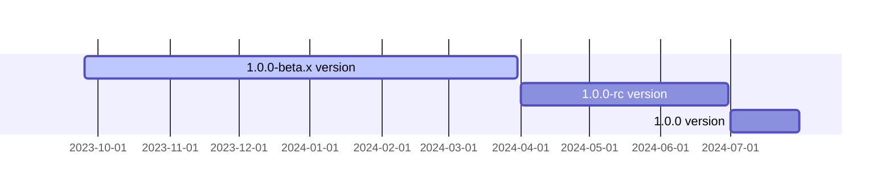

<p align="center">
  <a href="https://opentiny.design/tiny-engine" target="_blank" rel="noopener noreferrer">
    
  </a>
</p>
<p align="center">tiny-engine-data-center, also known as the data center, uses the strAPI ORM data management open source framework to provide data services to tiny-engine-webservice by encapsulating the API for basic operations on data tables</p>


English | [简体中文](README.zh-CN.md)

### Instruction Manual
For specific server usage documentation, please see [TinyEngine Official Website - User Manual](https://opentiny.design/tiny-engine#/help-center/course/backend/51)

### development
## Environment variables
|Variable name|Description
|---|---|
|MYSQL_HOST|mysql service ip address|
|MYSQL_PORT|The mysql service port, default 3306|
|MYSQL_DBNAME|mysql service database name|
|MYSQL_PASSWORD|mysql service password|
If Redis is used, the configuration example is as follows:
|Variable name|Description
|---|---|
REDIS_HOST|Redis service ip address|
REDIS_PORT|The redis service port, default 6380|
|RADIS_PASSWORD|Redis service password|
|REDIS_DB|The number of the Redis database connection, default 2|
## Local Runtime Configuration Method:
git-bash or bash
`vi ~/.bashrc`
```
export MQ_IP=192.168.0.11
export MQ_PORT=5671
# Wait for environment variables
```
After setting, reopen the command line or execute it in the current command line
```
source ~/.bashrc
```
Make the set environment variables take effect;(The environment variables set in git bash cannot be applied to powershell and cmd)
Start project
Go to the root directory of the project and execute it in sequence
### Milestones



### 🤝 Participating in contributions

If you are interested in our open source project, please join us!

Please read the Contribution Guide (CONTRIBUTING.zh-CN.md) before participating in the contribution.

- Add official assistant WeChat opentiny-official and join the technical exchange group
- Join the mailing list opentiny@googlegroups.com

### Open source protocol

[MIT](LICENSE)
