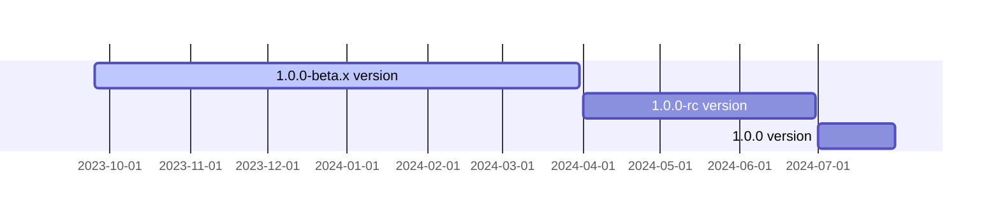

<p align="center">
  <a href="https://opentiny.design/tiny-engine" target="_blank" rel="noopener noreferrer">
    
  </a>
</p>

<p align="center">tiny-engine-data-center，也称为数据中心，使用strAPI ORM数据管理开源框架，通过封装API对数据表进行基本操作，为tiny-engine-webservice提供数据服务</p>

[English](README.md) | 简体中文

### 使用手册
具体服务端使用文档请查看[TinyEngine 官网-使用手册](https://opentiny.design/tiny-engine#/help-center/course/backend/51)
### 开发
安装所需的依赖

```
$ npm install
```
环境变量
|变量名称|说明
|---|---|
|MYSQL_HOST|mysql服务ip地址|
|MYSQL_PORT|mysql服务端口，默认 3306|
|MYSQL_DBNAME|mysql 服务数据库名称|
|MYSQL_PASSWORD|mysql服务密码|

如果使用了redis, 配置示例如下：

|变量名称|说明
|---|---|
|REDIS_HOST|redis服务ip地址|
|REDIS_PORT|redis服务端口，默认 6380|
|RADIS_PASSWORD|redis服务密码|
|REDIS_DB|redis连接的存储区编号， 默认 2|

## 本地运行时配置方式：

git-bash 或 bash
`vi ~/.bashrc`
```sh
export MQ_IP=192.168.0.11
export MQ_PORT=5671
# 等等环境变量
```
设置完后，重新打开命令行或则在当前命令行执行
```sh
source ~/.bashrc
```
让设置的环境变量生效；(git bash中设置的环境变量无法适用于powershell 和cmd)
启动项目
进入到项目根目录下，依次执行

```
yarn install --ignore-engines
npm run build
npm run dev
```
### 里程碑


### 🤝 参与贡献

如果你对我们的开源项目感兴趣，欢迎加入我们！🎉

参与贡献之前请先阅读[贡献指南](CONTRIBUTING.zh-CN.md)。

- 添加官方小助手微信 opentiny-official，加入技术交流群
- 加入邮件列表 opentiny@googlegroups.com

### 开源协议

[MIT](LICENSE)
